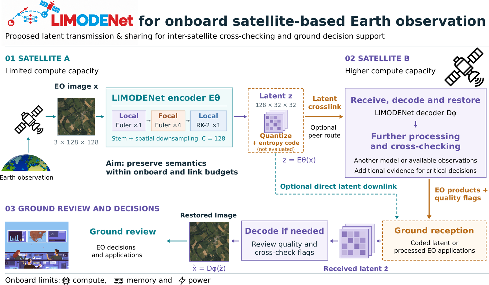
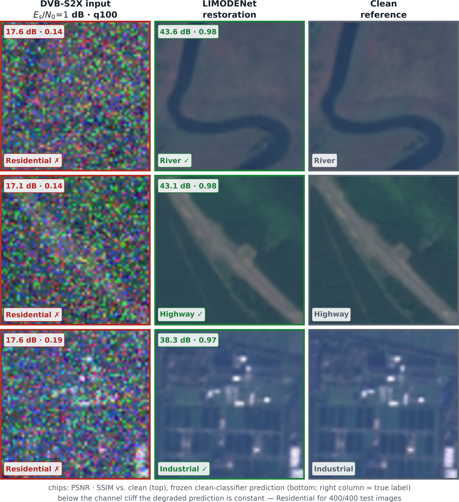
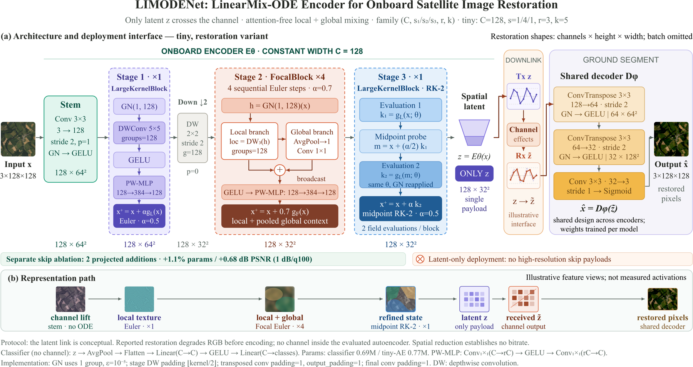

<p align="center">
  
</p>

<h3 align="center">Attention-Free Compact Encoders for Information-Preserving<br>Onboard Satellite Image Restoration</h3>

<p align="center">
  <a href="https://arxiv.org/abs/2609.14690">Paper (arXiv)</a> ·
  <a href="https://huggingface.co/ltdung/limodenet">Weights (HuggingFace)</a> ·
  <a href="#citation">Citation</a>
</p>

<p align="center">
  
</p>

LIMODENet (LinearMix-ODENet) is a compact (0.69M-parameter), softmax-/QKV-free
convolutional backbone for restoring channel-degraded Earth-observation
imagery, designed under the constraint that it must also run as a spiking
network on neuromorphic accelerators (BrainChip Akida, Intel Loihi-2) —
which rules out the attention and channel-gating mechanisms most modern
restoration architectures rely on.

**We do not claim LIMODENet is the best restorer available.** Two modern CNN
restorers (NAFNet, Restormer) beat it on raw fidelity. What we show, and
measure rather than assert, is that LIMODENet is the best restorer that is
*verifiably deployable* where the power budget actually is: it converts
end-to-end to a spiking network with **zero blocked operations**, while the
fidelity-winning competitors have 22–24 each and have no established path to
neuromorphic hardware at all. See the paper for the full argument.

## Why onboard

<p align="center">
  
</p>

A satellite encodes the scene onboard under a hard compute, memory and power
budget; only the latent `z` crosses the channel. A peer satellite or the ground
segment decodes and restores it. The encoder therefore has to be small, has to
preserve the information a downstream task will need, and — if it is to run on
the neuromorphic parts that fit the power budget — cannot use softmax,
attention, or channel gating.

## Headline results

**Restoration, 1 dB DVB-S2X-degraded EuroSAT, iso-parameter, 3 seeds:**

| Encoder | Params | PSNR (dB) | SSIM | Recon→classify Top-1 (%) |
|---|---|---|---|---|
| CNN autoencoder | 0.75M | 35.64 ± 0.18 | 0.9531 ± 0.0017 | 71.89 ± 0.77 |
| Skip-connection U-Net | 0.75M | 36.32 ± 0.33 | 0.9591 ± 0.0027 | 77.17 ± 0.89 |
| **LIMODENet-AE** | 0.77M | **37.39 ± 0.14** | **0.9672 ± 0.0010** | **78.50 ± 0.83** |
| **LIMODENet-skip** | 0.78M | **38.07 ± 0.26** | **0.9716 ± 0.0014** | **80.66 ± 0.54** |

**Spiking conversion (T=8), measured against the ANN:**

| | Classifier (EuroSAT) | Reconstructor (LIMODENet-skip, 1dB/100q) |
|---|---|---|
| ANN | 98.47% top-1 | 38.07 ± 0.26 dB / 80.66 ± 0.54% |
| Spiking | 93.55 ± 0.54% top-1 (−4.9 pp) | 35.95 ± 0.05 dB (−2.12 dB) / 80.22 ± 0.20% (n.s.) |
| Blocked ops | 0 (vs. NAFNet-lite 24, Restormer-lite 22) | 0 (vs. NAFNet-lite 24, Restormer-lite 22) |

<p align="center">
  
</p>

Downstream task accuracy survives spiking conversion; pixel fidelity pays a
real, measured cost. Full tables, judge-control analysis, and the energy
measurements are in the paper.

## Install

```bash
git clone https://github.com/ltdung/limodenet
cd limodenet
pip install -e .                 # core: classifier + reconstructor
pip install -e ".[spiking]"      # + spiking conversion (snntorch)
pip install -e ".[hub]"          # + scripts/download_weights.py
```

## Quickstart

```python
import torch
from limodenet.family import build          # classifier
from limodenet.recon import build_recon      # reconstructor

# Classifier
model = build("tiny", num_classes=10)
model.load_state_dict(torch.load("weights/limodenet-tiny-eurosat-tinft.pth"))
logits = model(images)                        # images: (N, 3, 64, 64)

# Reconstructor (LIMODENet-skip: the kill-test-verified, spiking-legal cell)
recon = build_recon("limodenet_skip")
recon.load_state_dict(torch.load("weights/limodenet-skip-ae-1db100q.pth"))
restored = recon(degraded_images)              # images: (N, 3, 128, 128) in [0,1]
```

```python
# Spiking conversion (requires `pip install snntorch`)
from limodenet.snn_recon import SpikingLIMODENetSkipRecon, warm_start

spiking_recon = SpikingLIMODENetSkipRecon(T=8)
warm_start(spiking_recon, "weights/limodenet-skip-ae-1db100q.pth")  # ANN weights in
restored = spiking_recon(degraded_images)       # T=8 simulated timesteps
```

Download weights first:
```bash
python scripts/download_weights.py --list          # see what's available
python scripts/download_weights.py                  # everything, into weights/
```

## Architecture

<p align="center">
  
</p>

Three residual stages read as ODE discretizations: a LargeKernelBlock Euler
step, four Focal Euler steps whose global branch mixes pooled context without
attention, and a midpoint RK-2 stage with two field evaluations sharing one set
of weights. Constant width `C = 128`; 0.69M parameters as a classifier, 0.77M
as an autoencoder. Every operation is spiking-legal.

## Repository layout

```
limodenet/
├── blocks.py       # DWConv, PWMLP, LargeKernelBlock (Euler/Heun), FocalBlock
├── family.py        # classifier: nano/tiny/small/base/big presets
├── recon.py          # reconstructor: LIMODENet-AE + skip/depth4 kill-test cells
├── snn.py             # spiking classifier conversion (snntorch)
└── snn_recon.py        # spiking reconstructor conversion (snntorch)
scripts/
├── train_classifier.py
├── train_reconstructor.py
├── convert_to_spiking.py
├── evaluate.py
└── download_weights.py
demo/
└── app.py            # Gradio demo (degrade -> restore -> classify)
docs/
└── REPRODUCING.md    # maps each paper table/figure to a script + config
```

## Weights

Released on the [HuggingFace Hub](https://huggingface.co/ltdung/limodenet) under CC-BY-NC-4.0 (see
`WEIGHTS_LICENSE.md`) — code stays MIT. Nine checkpoints, chosen to cover
every architecture claim in the paper (the classifier family, the two
released reconstructor variants, and both spiking conversions). Baseline
checkpoints (CNN-AE, U-Net, NAFNet-lite, Restormer-lite, DnCNN) are not
released, but are re-trainable from `scripts/train_reconstructor.py`'s
configs listed in `docs/REPRODUCING.md`.

| Name | Params | Headline number |
|---|---|---|
| `limodenet-nano-eurosat.pth` | 0.39M | 95.65 ± 0.23% (EuroSAT, scratch) |
| `limodenet-small-eurosat.pth` | 1.55M | 96.93 ± 0.16% |
| `limodenet-base-eurosat.pth` | 2.73M | 97.26 ± 0.17% |
| `limodenet-tiny-eurosat-tinft.pth` | 0.69M | 98.26% (Tiny-ImageNet pretrained + FT) |
| `limodenet-big-eurosat-tinft.pth` | 5.80M | 97.5–98.5% range (off-ladder) |
| `limodenet-ae-1db100q.pth` | 0.77M | 37.39 ± 0.14 dB PSNR |
| `limodenet-skip-ae-1db100q.pth` | 0.78M | 38.07 ± 0.26 dB PSNR |
| `limodenet-spiking-classifier-t8.pth` | 0.69M | 93.55 ± 0.54% top-1, T=8 |
| `limodenet-spiking-skip-recon-t8.pth` | 0.78M | 35.95 ± 0.05 dB PSNR, T=8 |

## Data

We do not redistribute EuroSAT, NWPU-RESISC45, UCMerced, PatternNet, or
RSICB128 — download them from their original sources. The DVB-S2X channel
emulator used to produce the degraded EuroSAT pairs in the paper is not
publicly released; `scripts/train_reconstructor.py` expects paired
`degraded/`/`clean/` folders in the format the emulator produced (see
`docs/REPRODUCING.md` for the exact layout), so you will need an equivalent
channel/compression simulator to reproduce the DVB-S2X numbers exactly. The
paper's second-corpus check (ImageNet-C corruptions on PatternNet) *is*
fully reproducible with public tools — see `docs/REPRODUCING.md`.

## Citation

```bibtex
@article{le2026limodenet,
  title   = {LIMODENet: Attention-Free Compact Encoders for Information-Preserving
             Onboard Satellite Image Restoration},
  author  = {Le, Thanh-Dung and Ha, Vu Nguyen and
             Nguyen, Ti Ti and Chatzinotas, Symeon},
  journal = {arXiv preprint arXiv:2609.14690},
  year    = {2026}
}
```

## License

Code: MIT (`LICENSE`). Weights: CC-BY-NC-4.0 (`WEIGHTS_LICENSE.md`).
