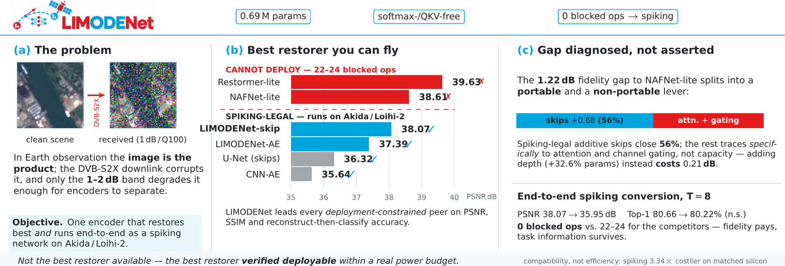

<p align="center">
  
</p>

<h3 align="center">Attention-Free Compact Encoders for Information-Preserving<br>Onboard Satellite Image Restoration</h3>

<p align="center">
  <a href="https://arxiv.org/abs/2609.14690">Paper (arXiv)</a> ·
  <a href="https://github.com/ltdung/limodenet">Code (GitHub)</a>
</p>

<p align="center">
  
</p>

LIMODENet is a compact (0.69M-parameter), softmax-/QKV-free convolutional
backbone for restoring channel-degraded Earth-observation imagery, designed
under the constraint that it must also run as a spiking network on
neuromorphic accelerators (BrainChip Akida, Intel Loihi-2). We do not claim
it is the best restorer available — two modern CNN restorers (NAFNet,
Restormer) beat it on raw fidelity. What we show is that it is the best
restorer that is *verifiably deployable* where the power budget actually is:
it converts end-to-end to a spiking network with **zero blocked operations**,
while the fidelity-winning competitors have 22–24 each.

Code: `pip install git+https://github.com/ltdung/limodenet`

```python
import torch
from limodenet.recon import build_recon
from huggingface_hub import hf_hub_download

path = hf_hub_download("ltdung/limodenet", "limodenet-skip-ae-1db100q.pth")
model = build_recon("limodenet_skip")
model.load_state_dict(torch.load(path))
restored = model(degraded_images)   # (N, 3, 128, 128), values in [0, 1]
```

## Checkpoints

| File | Task | Params | Headline number |
|---|---|---|---|
| `limodenet-nano-eurosat.pth` | classification | 0.39M | 95.65 ± 0.23% top-1 (EuroSAT, scratch, 3-seed) |
| `limodenet-small-eurosat.pth` | classification | 1.55M | 96.93 ± 0.16% |
| `limodenet-base-eurosat.pth` | classification | 2.73M | 97.26 ± 0.17% |
| `limodenet-tiny-eurosat-tinft.pth` | classification | 0.69M | 98.26% (Tiny-ImageNet pretrained + fine-tuned) |
| `limodenet-big-eurosat-tinft.pth` | classification | 5.80M | off-ladder legacy config, Tiny-ImageNet FT |
| `limodenet-ae-1db100q.pth` | restoration | 0.77M | 37.39 ± 0.14 dB PSNR, 1dB/100q DVB-S2X |
| `limodenet-skip-ae-1db100q.pth` | restoration | 0.78M | 38.07 ± 0.26 dB PSNR, same condition |
| `limodenet-spiking-classifier-t8.pth` | classification, spiking | 0.69M | 93.55 ± 0.54% top-1, T=8, ANN-init |
| `limodenet-spiking-skip-recon-t8.pth` | restoration, spiking | 0.78M | 35.95 ± 0.05 dB PSNR, T=8, zero blocked ops |

All classification numbers are on EuroSAT (10-class RGB land-use). All
restoration numbers are on 1 dB $E_s/N_0$, JPEG quality 100 DVB-S2X-degraded
EuroSAT, three-seed mean ± std unless noted. `seed 0` of each 3-seed run is
released; see the paper for the full 3-seed statistics.

## Loading

```python
# Classifier
from limodenet.family import build
model = build("tiny", num_classes=10)
model.load_state_dict(torch.load("limodenet-tiny-eurosat-tinft.pth"))

# Reconstructor
from limodenet.recon import build_recon
model = build_recon("limodenet_skip")   # or "limodenet" for the plain AE
model.load_state_dict(torch.load("limodenet-skip-ae-1db100q.pth"))

# Spiking classifier (needs `pip install snntorch`)
from limodenet.snn import SpikingLIMODENet
model = SpikingLIMODENet(num_classes=10, T=8)
model.load_state_dict(torch.load("limodenet-spiking-classifier-t8.pth"))

# Spiking reconstructor
from limodenet.snn_recon import SpikingLIMODENetSkipRecon
model = SpikingLIMODENetSkipRecon(T=8)
model.load_state_dict(torch.load("limodenet-spiking-skip-recon-t8.pth"))
```

## License

Weights: **CC-BY-NC-4.0** (non-commercial). Code: MIT. See the GitHub repo's
`WEIGHTS_LICENSE.md` for details, or contact the authors for a commercial
license.

## Citation

```bibtex
@article{le2026limodenet,
  title   = {LIMODENet: Attention-Free Compact Encoders for Information-Preserving
             Onboard Satellite Image Restoration},
  author  = {Le, Thanh-Dung and Ha, Vu Nguyen and
             Nguyen, Ti Ti and Chatzinotas, Symeon},
  journal = {arXiv preprint arXiv:2609.14690},
  year    = {2026}
}
```
